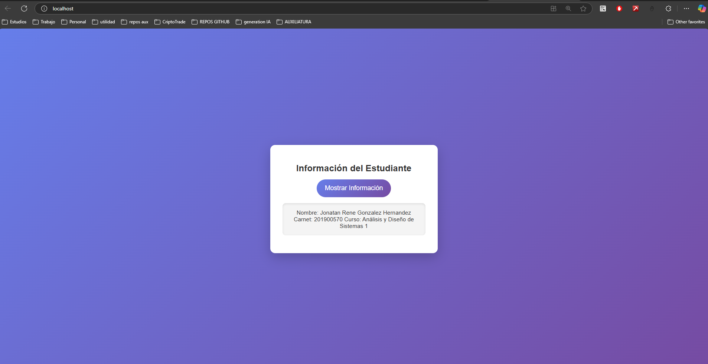

# Ejecutar con Docker

1. **Construir la Imagen:**
   ```bash
   docker build -t tarea2 .
   ```

2. **Ejecutar el Contenedor:**
   ```bash
   docker run -d -p 80:80 tarea2
   ```

3. **Abrir en el navegador:**
   [http://localhost](http://localhost)

   <!-- mostrar img en src/iamge.png -->
    